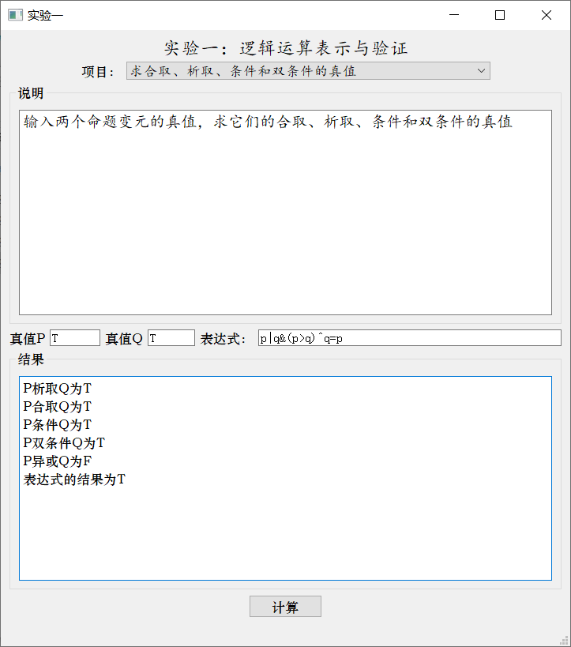
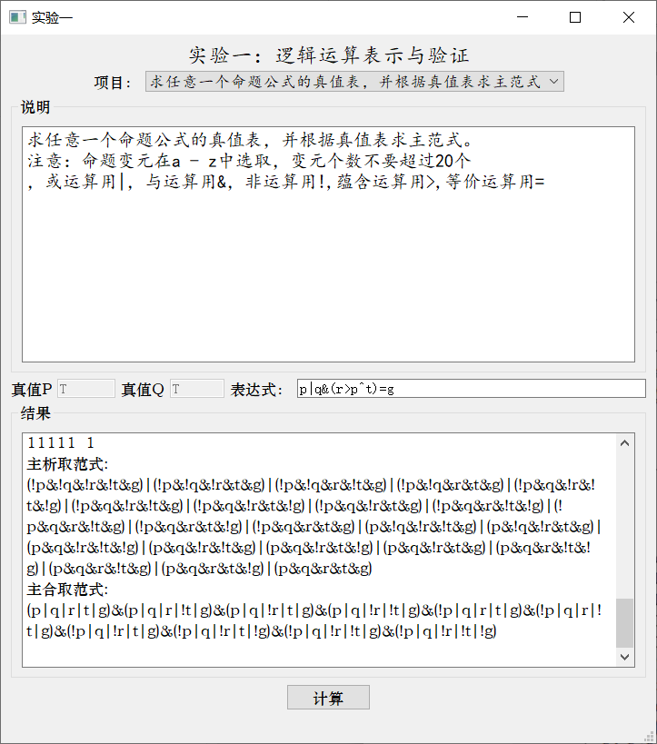
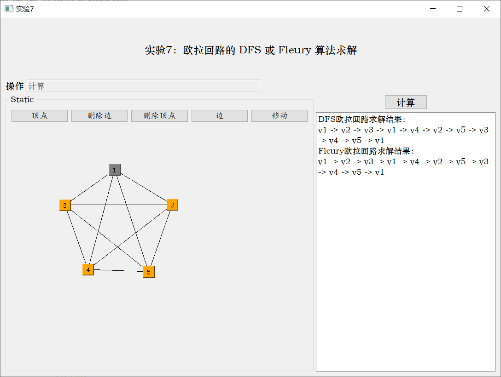
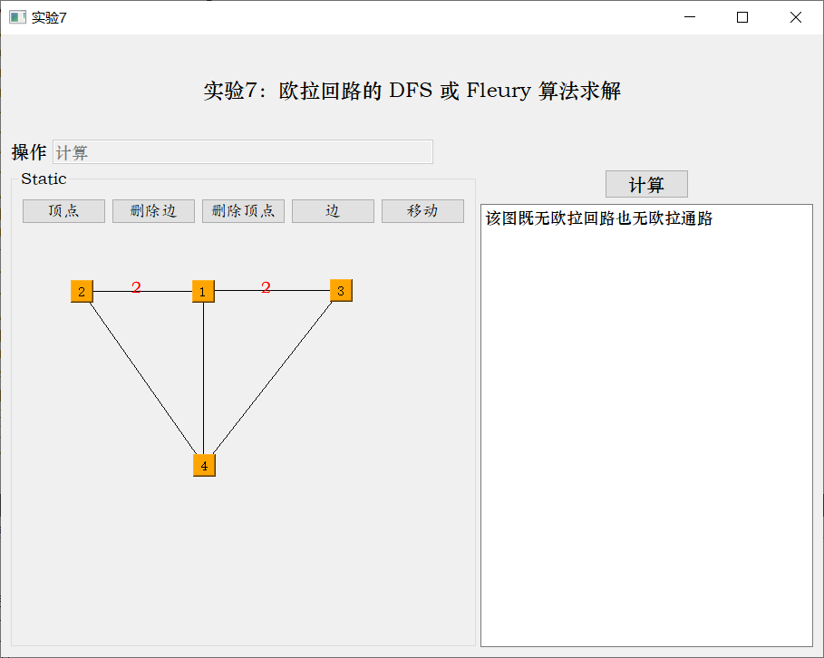

# 离散数学实验

大二上离散数学实验

日期：2018年11月

开发工具：Qt5

## 项目结构说明

| 文件夹名 | 说明                                 |
| -------- | ------------------------------------ |
| lab1     | 逻辑运算表示与验证                   |
| lab4     | 关系闭包运算与Floyd-Warshall算法求解 |
| lab7     | 欧拉回路的 DFS 或Fleury算法求解      |

**注**：实验七后期检测程序存在bug，导致崩溃，暂时不想解决

## 运行示例图片

